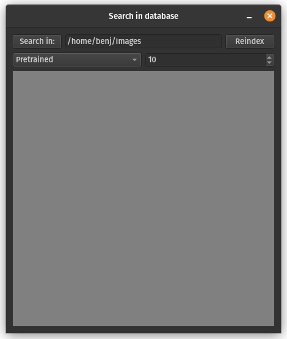

# LocalImageSearch

A simple tool for local reverse image search

## Installation

1) clone the repository.
2) in the command line, navigate to the repository.
3) create a virtual environment (python3 -m venv LocalImageSearchEnv).
4) start the environment.
   Linux/Mac: source LocalImageSearchEnv/bin/activate
   Windows: LocalImageSearchEnv\bin\activate.bat
5) install the requirements (python3 -m pip install -r requirements.txt).

## Usage

1) start the environment.
   Linux/Mac: source LocalImageSearchEnv/bin/activate
   Windows: LocalImageSearchEnv\bin\activate.bat
2) launch the software (python3 dbSearchGui.py).
3) Select a directory to search in with the "Search in" button.
4) Select the model. The Pretrained model is pretrained on ImageNet and usually provides good embeddings. You can add your own model in place of the Finetuned model. Our Finetuned model has been optimized on drawings, and might give better results in certain cases.
5) Select the number of images displayed on each page.
6) Drag-and drop an image in the grey square to start a search.
Results will open in a new window. 
If the directory has not been indexed yet, this could take some time as all images have to pass through the model. 
7) If results seem outdated, try reindexing the directory using the button in the top right.

## Troubleshooting and known errors

### Installation

Under linux, this error may appear while installing required pachages: "/usr/bin/python3: No module named pip". In this case, just install pip in your system. In debian-based systems, use $ sudo apt install python3-pip

### Known limitations

Note that the method used is an exact nearest neighbour search. It does not scale well to very large image sets. This is good enough for fast search through a few thousand images, so I don't plan to change this unless there is demand.
